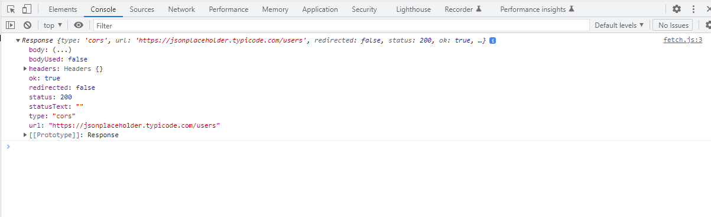

# AJAX

## ¿Qué es?

Ajax (_Asynchronous Javascript And XML_) en pocas palabras es el uso del objeto **XMLHttpRequest** para comunicarse con servidores.

Podemos enviar y recibir información en varios formatos, como : JSON, XML, HTML y TXT.

Lo esencial de AJAX es su naturaleza _**asíncrona**_, lo que permite poder comunicarse con el servidor, intercambiar datos y actualizar la página sin tener que recargar el navegador.


Ajax no es una tecnología en sí mismo, es el conjunto de varias tecnologías independientes que se unen para conseguir su funcionalidad.

- **HTML** y **CSS**, para crear una presentación basada en los estándares de la web.
- **DOM**, para la interacción y manipulación dinámica de la presentación.
- **HTML**, **XML**, y **JSON**, para el intercambio y manipulación de la información.
- **XMLHttpRequest** o **Fetch**, para el intercambio asíncrono de la información.
- **Javascript**, para unir y sincronizar todas las tecnologías.

Es importante conocer los códigos de estado de la respuesta HTTP.

### Códigos de respuesta HTTP

1. Respuestas informativas (100 - 199)
2. Respuestas satisfactorias (200 - 299)
3. Redirecciones (300 - 399)
4. Errores del cliente (400 - 499)
5. Error de servidor (500 - 599)

Puedes revisar la documentación de MDN para [mas información](https://developer.mozilla.org/es/docs/Web/HTTP/Status).

## Como usar AJAX

Podemos hacer uso de AJAX de diferentes formas.

### Métodos Nativos

- ActiveXObject (IE8 e inferiores,esta depreciado)
- XMLHttpRequest
- API Fetch

### Librerías Externas

- JQuery,ajax (solo se usa para dar soporte)
- Axios (librería de terceros, actualmente la más usada)
- ect.

## 5 Formas de Usar AJAX

- Objeto XMLHttpRequest
- API Fetch
- API Fetch + (Async - Await)
- Librería Axios
- Librería Axios + (Async - Await)

Para efectos prácticos y de aprendizaje usaremos la API de prueba de [JSON Placeholder](https://jsonplaceholder.typicode.com/)

### Objeto XMLHttpRequest

_XMLHttpRequest_ es un objeto de _Javascript_, actualmente es un estándar de la **_W3C_**.

Proporciona una forma fácil de obtener información de una URL sin tener que recargar la pagina completa.

Puede ser usado para recibir cualquier tipo de dato no solo XML, y admite otros formatos ademas de HTTP incluyendo **file** y **ftp**.

Es importante conocer los estados de un petición XMLHttpRequest, estos estados serán mostrados en la propiedad **_readyState_** del objeto XMLHttpRequest.

| Valor |      Estado      | Descripción                                                           |
| :---: | :--------------: | :-------------------------------------------------------------------- |
|   0   |      UNSET       | El cliente ha sido creado. open() no llamado todavía.                 |
|   1   |      OPENED      | open() ha sido llamado                                                |
|   2   | HEADERS_RECEIVED | send() Se ha llamado y los encabezados y el estado están disponibles. |
|   3   |     LOADING      | responseText contiene datos parciales                                 |
|   4   |       DONE       | La operación esta completa                                            |

Ejemplo:

Los pasos mas importantes son:

- Realizar una petición HTTP al servidor.

```javascript
//  1. creamos un objeto XMLHttpRequest
const xhr = new XMLHttpRequest();

// 2. abrimos la conexión
xhr.open("GET", "https://jsonplaceholder.typicode.com/users");

// 3. enviamos la petición
xhr.send();
```

- Procesar la respuesta del servidor

```javascript
// 4. asignamos el evento readystatechange al objeto xhr
xhr.addEventListener("readystatechange", (e) => {
  // revisamos el estado de la petición
  if (xhr.readyState !== 4) return;

  // 5. Revisar el código de status de la respuesta HTTP.
  if (xhr.status >= 200 && xhr.status < 300) {
    console.log("éxito");
  }
});
```

- Obtener la información de respuesta

Podemos convertir la respuesta en los formatos con los que mas nos convenga trabajar.

```javascript
//  6. convertir la respuesta al formato que necesitemos
let json = JSON.parse(xhr.responseText);
console.log(json);
```

Una vez hayamos realizados estos pasos esenciales, podemos continuar con nuestro código según nuestras necesidades.

A continuación veamos el código completo.

Código HTML

```html
<!DOCTYPE html>
<html lang="en">
  <head>
    <meta charset="UTF-8" />
    <meta name="viewport" content="width=device-width, initial-scale=1.0" />
    <title>Ajax - XMLHttpRequest</title>
  </head>

  <body>
    <h2>Ajax - XMLHttpRequest</h2>
    <div id="xhr"></div>
    <script src="xhr.js"></script>
  </body>
</html>
```

Código JavaScript

```javascript
//  1. creamos un objeto XMLHttpRequest
const xhr = new XMLHttpRequest(),
  $xhr = document.getElementById("xhr"),
  $fragment = document.createDocumentFragment();

// 2. abrimos la conexión
xhr.open("GET", "https://jsonplaceholder.typicode.com/users");

// 3. enviamos la petición
xhr.send();

// 4. asignamos el evento readystatechange al objeto xhr
xhr.addEventListener("readystatechange", (e) => {
  // revisamos el estado de la petición
  if (xhr.readyState !== 4) return;

  // 5. Revisar el código de status de la respuesta HTTP.
  if (xhr.status >= 200 && xhr.status < 300) {
    console.log("éxito");
    //  6convertir la respuesta al formato que necesitemos
    let json = JSON.parse(xhr.responseText);
    console.log(json);

    json.forEach((el) => {
      const $li = document.createElement("li");
      $li.innerHTML = `${el.name} -- ${el.email} -- ${el.phone}`;
      $fragment.appendChild($li);
    });

    $xhr.appendChild($fragment);
  } else {
    console.log("error");
    let message = xhr.statusText || "Ocurrió un error";
    $xhr.innerHTML = `Error ${xhr.status}: ${message} `;
  }

  console.log("Este mensaje se mostrara sin importar el estado de la petición");
});
```

### API Fetch

Este mecanismo proporciona una interfaz para recuperar recursos, incluso a traves de la red. Ofrece un conjunto de características mas potente y flexible que _XMLHttpRequest_.

Fetch ofrece una definición genérica de los objetos _Request_ y _Response_, el método Fetch toma un argumento obligatorio que es la ruta de acceso al recurso que se desea recuperar, devuelve una promesa que se resuelve en el _Response_, sea o no correcta, opcionalmente también puede pasar un objeto de opciones como segundo parámetro.

Las propiedades mas importantes de la Interfaz response son:

- response.ok: Contiene un estado indicando si la respuesta fue exitosa (estado en el rango 200-299) o no.
- response.status: Contiene el código de estado de la respuesta (e.g., 200 si fue exitosa).
- Response.statusText: Contiene el mensaje de estado correspondiente al código de estado (e.g., OK para el Código 200).

Y sus métodos:

- Response.error(): Devuelve un nuevo objeto Respuesta asociado a un error de red.
- Body.blob(): Toma un flujo Response y lo lee hasta completarlo. Devuelve una promesa que resuelve con un Blob.
- Body.formData(): Toma un flujo Response y lo lee hasta completarlo. Devuelve una promesa que resuelve con un objeto FormData.
- Body.json(): Recibe un flujo Response y lo lee hasta completarlo. Devuelve una promesa que resuelve como JSON el texto del Body enviado.
- Body.text(): Recibe un flujo Response y lo lee hasta completarlo. Devuelve una promesa que resuelve con un USVString (en-US) (texto).

[Revisar la documentación de MDN para mas información](https://developer.mozilla.org/es/docs/Web/API/Response)

Ejemplo:

Como ya comentamos fetch devuelve una promesa que se resuelve en el response, veamos que devuelve la interfaz si ejecutamos el siguiente código.

```javascript
(() => {
  fetch("https://jsonplaceholder.typicode.com/users").then((res) => {
    console.log(res);
  });
})();
```



Listo, ya conocemos un poco mas esta interfaz, ahora validemos el estado de la petición.

```javascript
(() => {
  fetch("https://jsonplaceholder.typicode.com/users")
    //  validamos la respuesta
    .then((res) => (res.ok ? res.json() : Promise.reject()))
    .then((json) => {
      console.log(json);
    });
})();
```

Las bondades de las promesas nos permiten tratar los error en el catch, usemos el método error que nos devuelve un nuevo objeto Response con el error de red asociado.

```javascript
(() => {
  const $fetch = document.getElementById("fetch"),
    $fragment = document.createDocumentFragment();
  fetch("https://jsonplaceholder.typicode.com/users")
    //  validamos la respuesta
    .then((res) => (res.ok ? res.json() : Promise.reject()))
    .then((json) => {
      console.log(json);
    })
    //  en caso de error, personalizamos la respuesta
    .catch((err) => {
      console.log(err);
      let message = err.statusText || "Ocurrió un error";
      $fetch.innerHTML = `Error ${err.status}: ${message}`;
    });
})();
```

Estos son los pasos mas importantes, ahora podemos continuar con el desarrollo del código según nuestras necesidades, completemos el código para obtener el mismo resultado del ejemplo anterior.

```javascript
(() => {
  const $fetch = document.getElementById("fetch"),
    $fragment = document.createDocumentFragment();

  //fetch("assets/users.json")
  fetch("https://jsonplaceholder.typicode.com/users")
    /* .then((res) => {
      console.log(res);
      return res.ok ? res.json() : Promise.reject(res);
    }) */
    .then((res) => (res.ok ? res.json() : Promise.reject(res)))
    .then((json) => {
      console.log(json);
      //$fetch.innerHTML = json;
      json.forEach((el) => {
        const $li = document.createElement("li");
        $li.innerHTML = `${el.name} -- ${el.email} -- ${el.phone}`;
        $fragment.appendChild($li);
      });

      $fetch.appendChild($fragment);
    })
    .catch((err) => {
      console.log(err);
      let message = err.statusText || "Ocurrió un error";
      $fetch.innerHTML = `Error ${err.status}: ${message}`;
    })
    .finally(() => {
      console.log(
        "Esto se ejecutará independientemente del resultado de la Promesa Fetch"
      );
    });
})();
```

### API Fetch + Async Await

SI bien es cierto con API Fetch se simplifica mucho la comunicación con servidores, la estructura de las promesas pueden llegar a no ser tan claras y pasa lo mismo que con las callbacks.

Entonces podemos combinar las promesas con la programación asíncrona para tratar la respuesta y manejar los errores de una manera mas sencilla y visualmente mas clara y comprensible.

Podemos resolver esto por medio de un bloque try-catch y funciones asíncronas, veamos el código completo.

```javascript
(() => {
  const $fetchAsync = document.getElementById("fetch-async"),
    $fragment = document.createDocumentFragment();
  // declarar la función asíncrona
  async function getData() {
    // implementamos un bloque try catch
    try {
      let res = await fetch("https://jsonplaceholder.typicode.com/users"),
        json = await res.json();
      // console.log(res, json);
      // validamos el estado de la petición
      if (!res.ok)
        //si la respuesta da error lanzamos un objeto error directamente en el catch
        throw {
          status: res.status,
          statusText: res.statusText,
        };
      json.forEach((el) => {
        const $li = document.createElement("li");
        $li.innerHTML = `${el.name} -- ${el.email} -- ${el.phone}`;
        $fragment.appendChild($li);
      });
      $fetchAsync.appendChild($fragment);
    } catch (err) {
      console.log(err);
      let message = err.statusText || "Ocurrió un error";
      $fetchAsync.innerHTML = `Error ${err.status}: ${message}`;
    } finally {
      console.log("Esto se ejecutará independientemente del try... catch");
    }
  }
  getData();
})();
```
